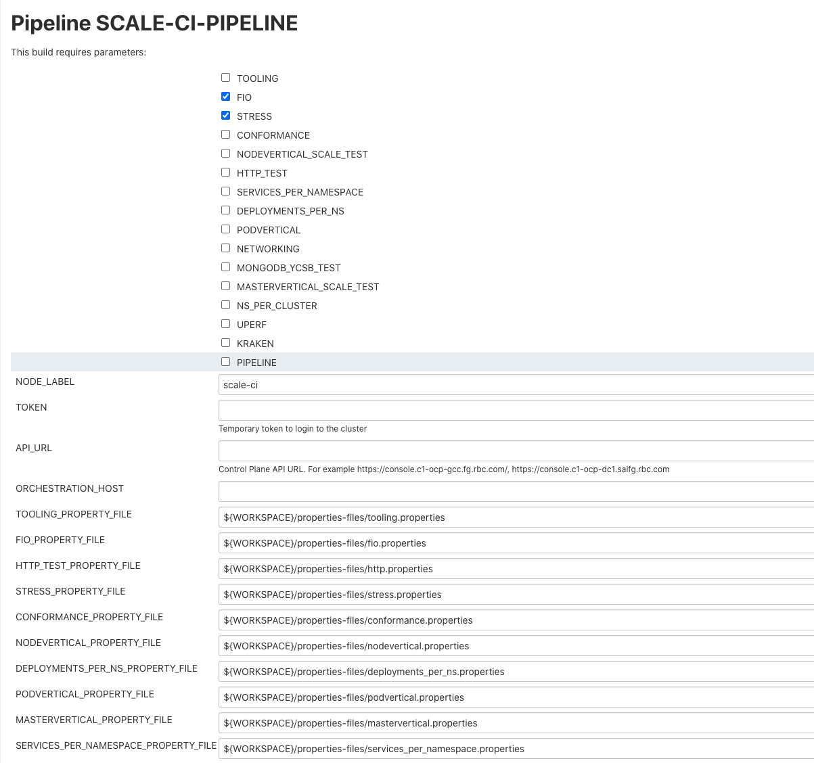

# workload-automation-setup
Workload automation/pipeline configuration and setup

## Scale-CI Jobs

The workloads were selected to address the following categories,

1. Control Plane Density
2. Data Plane Density
3. Cluster limits
4. OCP Application Router

TODO: Kraken is a possible choice for defining and implementing specific choas injection scenarios.

Following are the workloads identified,

Job   | OCP component/category | Description | 
----------------- | --------- | -------------------- |   
Node Vertical | Data plane density and Cluster Limits | Creates max pods per compute node | 
Master Vertical | Control plane density | Creates bunch of objects to stress ApiServer, Etcd and Controller |   
HTTP | Router | Data-plane workload generator that runs http requests through HAProxy into deployed pods |   
Pod Vertical | Cluster Limits | Tests pods per namespace limit |   
Deployments per namespaces | Cluster Limits | Tests deployments per namespace limit |   
Services per namespace | Cluster Limits | Tests maximum number of services possible per namespace | 
Namespaces per cluster | Cluster Limits | Tests namespaces per cluster limit |   
Kraken | Base/Idle cluster | Injects chaos scenarios into the cluster

### Dependencies

#### For bootstraping and configuration

Following are the dependencies required before you run the `bootstrap.sh` file,
 
- Jenkins server


- pip3 install jenkins-job-builder
- yum install jre -y

#### On the Orchestration Host

Following are the dependencies required on the orchestration host which is used for scale-ci,

- ansible version=2.9.12 (pip)
- jmespath version=0.9.0 (pip)
- wget (yum)
- git (yum)


### Assumptions
You have a preinstalled Jenkins server with OpenShift CLI (oc) and cached appropriate kubernetes config.

You have created Jenkins API Token using the Jenkins Management Console. 

For lack of integration with Vault (at the moment), we assume that this Jenkins server/worker is already setup with the necessary tooling to connect to the control plane of the target OpenShift cluster.

### Configure Jenkins job ini and workload-env sh file
- username/jenkins_user_id
- password/jenkins_api_token
- url/jenkins_url


### Bootstraping

1. Run `bootstrap.sh`

   For example,
   
   ```
    ./bootstrap.sh \
      --jenkins-user admin \
      --jenkins-password test \
      --jenkins-url http://scale-ci.innosre.net:8080/ \
      --host-user root \
      --host-pk-file ~/.ssh/id_rsa
   ```
   
   See `./bootstrap.sh --help` for more details.

2. Goto the Jenkins URL and traverse to the main Jenkins URL Pipeline Job - http://<JENKINS_URL>/job/SCALE-CI-PIPELINE/

3. Next enter the Token and URL for the Kubernetes Cluster and select the Workloads that you want to run.
    
   
   
   **Note:** If you leave Token or URL blank, then the automation assumes that the orchestration host has already logged into the target kubernetes cluster.
   
   **Note:** If you would like update the flags/properties associated with each workload, you can update and push the changes to the [scale-ci-pipeline repository](https://github.com/innovation-sre/scale-ci-pipeline/tree/master/properties-files) or run the workload job individually on Jenkins.
   
